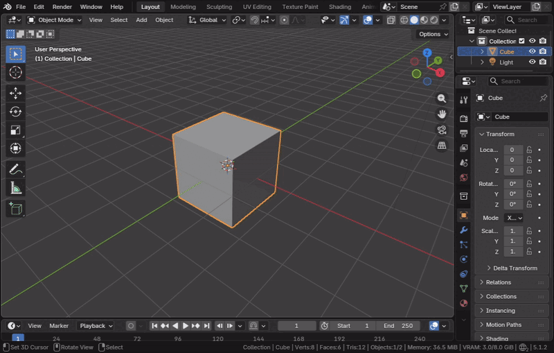
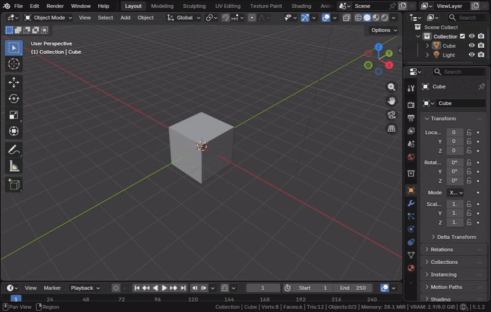

# Tobin's Enhanced Pie Menus

Custom shading configurations and advanced camera operations via pie menus for Blender 5.1.2+.

| Shading / Engine Menu (Hotkey: Z) | Camera Management Menu (Hotkey: Alt + C) |
| :---: | :---: |
|  |  |

## Features

### Shading / Engine Pie Menu (Replaces native shading pie)
- **Shading Modes:** Wireframe, Solid, Material Preview, Rendered.
- **Engine Toggles:** Switch to Eevee or Cycles (with auto-GPU detection).
- **Custom Shading Toggles:**
  - **MatCap Normals:** Instantly switches solid view to MatCap normal check map.
  - **Random Colors:** Assigns random viewport colors to each object.
  - **Default Solid:** Restores standard Solid shading with Studio lighting and material colors.

### Camera Actions Pie Menu (`Alt + C`)
- **Viewport Alignment:** Align Selected Camera to View, Align View to Camera, New Camera from View.
- **Transform Controls:** Point Camera at 3D Cursor, Level Horizon (removes Z roll).
- **Settings:** Lock Camera to View toggle, Quick Passepartout (mask) toggle, and opacity slider.

## Installation

1. Package the addon as a `.zip` (see building instructions below).
2. Open Blender, navigate to **Edit > Preferences > Extensions**.
3. Install the `.zip` file from disk.

## Packaging

Run the packaging script using PowerShell:
```powershell
./zip.ps1
```
This excludes development configuration files and outputs a clean `TobinsEnhancedPieMenus.zip` in the root folder.

## License

Source-Available under the [MIT + Commons Clause 1.0 License](LICENSE). Free for personal and commercial integration; direct commercial resale of the addon itself is prohibited.
